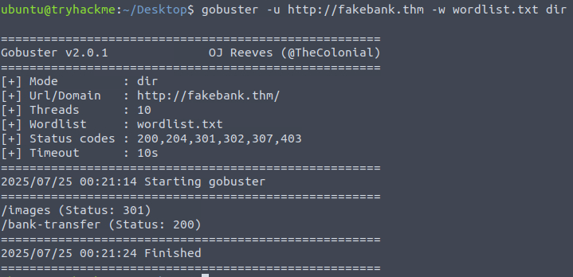

# 🧠 Offensive Security Intro  
🗓️ Date: 2025-07-24  
🔗 Room URL: https://tryhackme.com/room/offensivesecurityintro  
🏷️ Tags: [Red Team], [Offensive Security]

---

## 🧭 Overview  
A beginner-level room to introduce basic web hacking concepts in a legal, controlled environment.

This room demonstrates how gobuster can be used to discover sensitive endpoints (like `/bank-transfer`), which, when analyzed further, revealed an IDOR vulnerability due to missing authorization checks.  
這題示範了如何使用 gobuster 找到有意義的隱藏 endpoint，並在其中發現了 IDOR 漏洞。

---

## 🛠 Tools & Commands Used

| Tool      | Purpose                  | Sample Command                                 |
|-----------|--------------------------|------------------------------------------------|
| gobuster  | Directory brute-forcing  | `gobuster dir -u http://target -w wordlist.txt` |

---

## 🔍 Key Observations / What I Learned

- [x] **How to use gobuster to discover hidden web directories**  
  ➤ Gobuster 是用來找出「隱藏資源（hidden resources）」的工具，可以列舉出網站中未公開但實際存在的路徑（如 `/admin`、`/transfer` 等）。這個步驟屬於前期偵察（Reconnaissance），也叫「目錄列舉（Directory Enumeration）」。  
  ➤ Gobuster is a directory brute-forcing tool. It's useful for finding hidden endpoints by trying common paths with a wordlist.  
  ➤ Example: `gobuster dir -u http://target -w wordlist.txt`

- [x] **Importance of HTTP status codes (e.g., 200 vs 301)**  
  ➤ 了解 HTTP 狀態碼有助於判斷哪些目錄有效、哪些是轉址：  
    - `200 OK`：該路徑存在且可訪問  
    - `301 Moved Permanently`：代表轉址，通常導向帶 `/` 的目錄或靜態資源  
  ➤ Status codes help distinguish accessible vs. redirected content. 200 is actionable, while 301 often leads to static or less interesting areas.

- [x] **How attackers might leverage hidden endpoints**  
  ➤ 攻擊者會試圖從這些隱藏端點中找出敏感功能（如帳戶操作、轉帳、後台介面）並嘗試利用漏洞。  
  ➤ Even if not linked in the UI, hidden endpoints can still be accessed directly if known. These are often poorly secured.

- [x] **Why directory enumeration matters in early recon**  
  ➤ 在滲透測試的初期階段，枚舉目錄可以揭露潛在攻擊面。許多漏洞往往藏在沒有公開連結的路徑中。  
  ➤ Directory brute-forcing is often the first step to uncover admin panels, APIs, or test endpoints not intended for public use.

- [x] **Basic understanding of insecure direct object reference (IDOR)**  
  ➤ IDOR（不安全的直接物件參考）是一種授權漏洞，讓攻擊者可以透過修改參數（如帳號 ID）操作原本不屬於自己的資源。  
  ➤ In this room, I was able to initiate a money transfer by directly modifying the `from_account` parameter, showing how IDOR can let an attacker bypass authorization checks.

---

### 🗣️ English Practice Example:
> "I learned that IDOR vulnerabilities happen when the server doesn't check if the user is authorized to access or modify a resource identified by a parameter, like an account ID. In this case, I could transfer money by just changing a form field."

### 📘 中文練習備註：
> IDOR 漏洞發生在伺服器沒有驗證使用者是否有權限操作某個資源時。只要修改請求中的參數（例如帳號 ID），就可能達成未授權的資料存取或操作行為。

---

## 🖼️ Screenshot

---

## ⚠ Disclaimer

These notes are for personal learning purposes only. No answers or flags are shared. All tasks are completed by me, and all observations are based on legal, sandboxed exercises.
